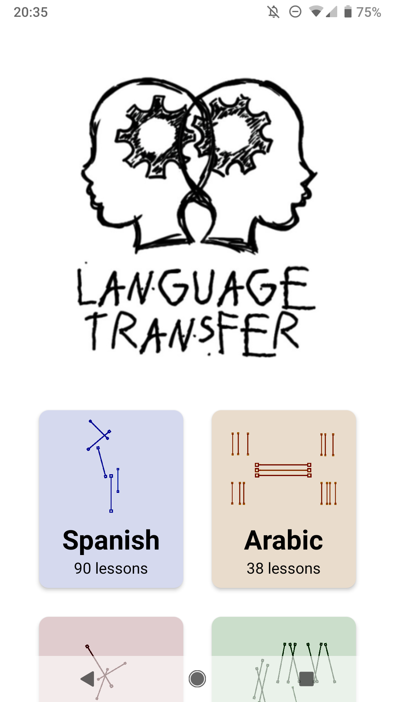
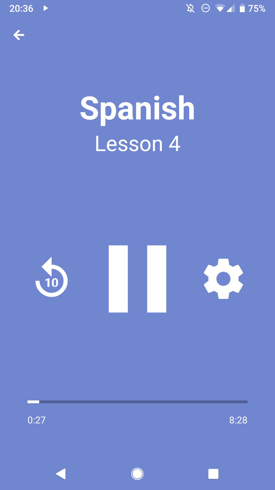
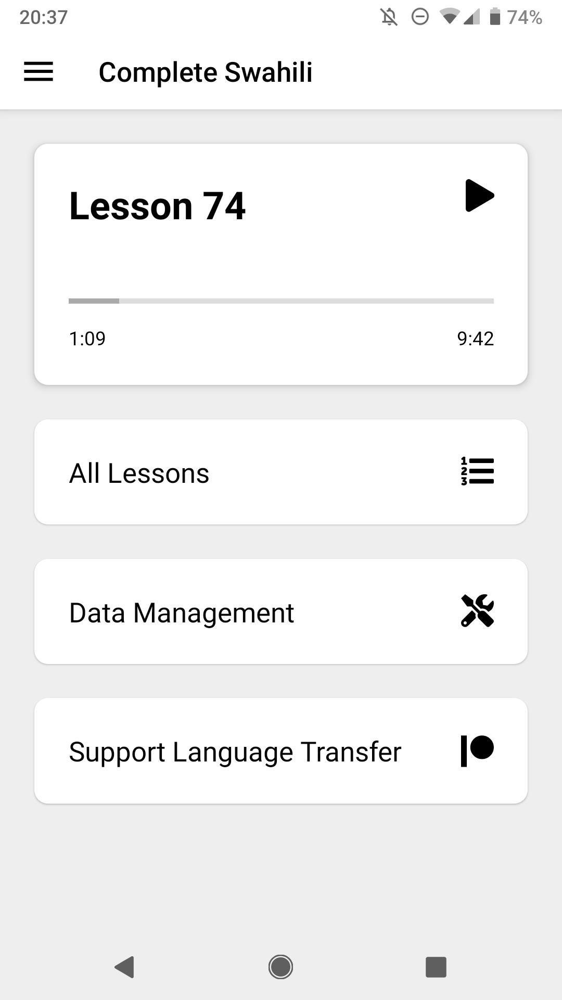

<p align="center">
  
</p>

## Language Transfer

[Language Transfer](https://www.languagetransfer.org/) is a project by Mihalis Eleftheriou, building audio courses for learning languages, completely free. At the moment, the following courses are available:

- Complete Spanish
- Complete Greek
- Complete Swahili
- Complete German (unfinished)
- Introduction to Arabic
- Introduction to Turkish
- Introduction to Italian
- Introduction to French
- Inglés Completo (para hispanohablantes); the previous introduction is available on Language Transfer's YouTube channel
- Introduction to Music Theory

You can find them on the [Language Transfer website](https://www.languagetransfer.org/courses).

## LT App

<p align="center">
  
  
  
</p>

This app is developed in React Native, and is designed to work with both iOS & Android platforms.

### iOS release policy

The Expo rewrite's iOS build and release workflow are not ready yet. Before shipping it on iOS, restore the platform-specific preloaded tracks required for App Store review. Those bundled tracks are an iOS-only requirement and must not be added to the Android build.

### Android release builds

Android release builds use the upload-key settings `MYAPP_UPLOAD_STORE_FILE`, `MYAPP_UPLOAD_KEY_ALIAS`, `MYAPP_UPLOAD_STORE_PASSWORD`, and `MYAPP_UPLOAD_KEY_PASSWORD` from the developer's Gradle properties (normally `~/.gradle/gradle.properties`). Keep the credentials and keystore out of Git.

The tracked `withAndroidReleaseSigning` Expo config plugin restores the release signing configuration whenever the ignored native Android project is generated. Place the keystore named by `MYAPP_UPLOAD_STORE_FILE` in `android/app/`; this file is ignored by Git. Generate and build the Play Store bundle locally with:

```sh
npx expo prebuild --platform android
cd android
./gradlew bundleRelease
```

The bundle is written to `android/app/build/outputs/bundle/release/app-release.aab`. Verify its signing certificate before uploading it to Google Play:

```sh
keytool -printcert -jarfile android/app/build/outputs/bundle/release/app-release.aab
```

### Android rapid-Back regression

`npm run test:android:rapid-back` is disabled pending an upstream
react-native-screens update. The known crash, upstream commits, and upgrade /
re-enable checklist are in [Android rapid-Back regression](./docs/android-rapid-back.md).

### Goals

The Language Transfer app should be:

- 100% free, like the Language Transfer courses
- Accessible and easy to use for the visually impaired
- Considerate of users in areas with poor network quality, expensive Internet access, or low-end devices
- Free of distractions and annoyances, like advertisements or superfluous notifications
- Self-sustaining: maintainable and easy to build even in the absence of the original maintainers
- Private by design, sharing only anonymous usage statistics

## Contributions

This app is largely in maintenance mode, so contributions are welcome but may not be addressed quickly by the maintainers.
If you want to contribute, be sure to read the [contributing guidelines](./CONTRIBUTING.md) and the [code of conduct](./CODE_OF_CONDUCT.md) before engaging with the project.

## License

The code for the Language Transfer app is provided under the [GPLv2 license](./LICENSE).

## Support

Please consider supporting Language Transfer's Patreon campaign. This money directly funds Mihalis and the development of future language courses as well as other materials.

<a href="https://www.patreon.com/languagetransfer"></a>
